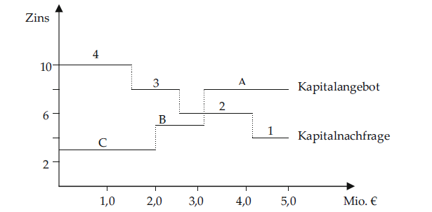

Dean-Modell
-----------

#### Kurzbeschreibung des Modells

Beim Dean-Modell handelt es sich um ein *Ein-Perioden-Modell* zur
Ermittlung eines optimalen Investitions- und Finanzierungsprogramms.
Dazu werden die möglichen Finanzierungsobjekte mit ihren jeweiligen
Finanzierungsvolumina und den jeweiligen *Soll-Zinsen* mit den möglichen
Investitionsobjekten mit ihren jeweiligen Investitionsvolumina und der
jeweiligen internen *Verzinsung* in einem Treppendiagramm dargestellt.
Der Schnittpunkt beider Funktionen kennzeichnet den endogenen
Grenzzinssatz, das Finanzierungs- und Investitionsvolumen und die
möglichen realisierbaren Investitionsobjekte. Die Interpretation hinter
diesem Modell leuchtet intuitiv ein: Es sollten nur die
Investitionsobjekte realisiert werden, deren interne Finanzierung größer
ist als die Finanzierungskosten. Dabei weisen alle im optimalen Programm
enthaltenen Investitionsobjekte einen positiven *Kapitalwert* auf, alle
nicht im Programm enthaltenen einen negativen Kapitalwert.

<h3>
<a name="menu">Inhaltsverzeichnis</a>
</h3>
<ul>
<li>
<a href="#1. Einleitung">1. Einleitung</a>
</li>
<li>
<a href="#2. Grundlegende Theorie">2. Grundlegende Theorie</a>
</li>
<li>
<a href="#3. Input und Output">3. Input und Output</a>
</li>
<li>
<a href="#4. Aufbau des Modells">4. Aufbau des Modells</a>
</li>
<li>
<a href="#5. Hinweise zur Anwendung">5. Hinweise zur Anwendung</a>
</li>
<li>
<a href="#6. Beispielhafte Anwendung">6. Beispielhafte Anwendung</a>
</li>
<li>
<a href="#7. Literatur">7. Literatur</a>
</li>
</ul>

<h3>
<a name="1. Einleitung">1. Einleitung</a>
</h3>

Das Dean-Modell wurde 1969 von Joel Dean entwickelt und dient zur
Ermittlung eines optimalen Investitions- und Finanzierungsprogramms.
Dabei soll dasjenige Bündel von Investitionsobjekten (-projekten)
identifiziert werden, welches vor dem Hintergrund begrenzter
Finanzierungsmöglichkeiten (Kapitalbudget) das Gewinnziel am besten
erfüllt. Beim Dean-Modell handelt es sich um ein Ein-Perioden-Modell.
Dieses wird vor allem durch zwei Eigenschaften charakterisiert: Zum
einen liegt hier eine simultane Investitions- und Finanzplanung vor, zum
anderen sind die Finanzierungszinssätze unterschiedlich hoch.

<h3>
<a name="2. Grundlegende Theorie">2. Grundlegende Theorie</a>
</h3>

Ein Ein-Perioden-Modell ist der einfachste Fall eines statischen
Finanzmarktmodelles. Dabei können folgende Prämissen angenommen werden:

1.  Es wird nur eine Periode betrachtet: Zeitspanne t=0 und t=1 (das
    kann der Zeitraum eines Jahres ggf. auch eine mehrjährige Periode
    sein).
2.  Es wird ein unvollkommener Kapitalmarkt unterstellt. Ein
    unvollkommener Kapitalmarkt unterstellt unterschiedliche Soll- und
    Habenzinssätze. Investition und Finanzierung sind unter dieser
    Bedingung nicht mehr beliebig austauschbar, sondern mit zusätzlichen
    Kosten verbunden.
3.  Kapitalaufnahme findet zum Zeitpunkt t=0 statt. Dabei stehen
    verschiedene, voneinander unabhängige, mit unterschiedlichem Zins
    (Soll-Zins) ausgestatteten Finanzierungsquellen zur Verfügung.
4.  Die finanziellen Mittel können eingesetzt werden, um mehrere
    voneinander unabhängige, bis zum Zeitpunkt t=1 laufende
    Investitionsprojekte zu realisieren. Alle Investitionsprojekte sind
    „Normalinvestitionen“ (zum Zeitpunkt t=0 erfolgt die Auszahlung, zum
    Zeitpunkt t=1 die Einzahlung), d.h. sie haben eine eindeutige
    interne Rendite (internen Zinssatz).
5.  Investitionsobjekte und Finanzierungsalternativen sind unabhängig
    voneinander und beliebig teilbar. Sie können dabei jeweils ganz, nur
    teilweise oder gar nicht realisiert werden.

Im Prinzip ist das Dean-Modell ein Rangordnungsverfahren. Sowohl die
Investitions- als auch die Finanzierungsobjekte werden nach ihrer
Vorteilhaftigkeit sortiert; die Investitionsobjekte nach fallender
Rendite, die Finanzierungsobjekte nach steigender Verzinsung.

Diese Rangordnung kann nun in einer Grafik über dem jeweiligen
Finanzvolumen aufgetragen werden. Es ergeben sich zwei
Treppenfunktionen:

1.  <strong> Kapitalnachfragefunktion: </strong> nach der Rendite
    sortierte Investitionsobjekte ergeben eine absteigende
    Kapitalnachfragefunktion
2.  <strong> Kapitalangebotsfunktion: </strong> nach der Verzinsung
    sortierten Finanzierungsobjekte ergeben eine aufsteigende
    Kapitalangebotsfunktion

*Darstellung eines Dean-Modells (aus BECKER 2012, S. 81)*

Durch den Schnittpunkt der Kapitalangebotsfunktion und der
Kapitalnachfragefunktion kann analysiert werden, welche
Investitionsobjekte realisiert werden sollten. Links des Schnittpunktes
liegen die rational realisierbaren Investitions- und
Finanzierungsobjekte. Das bedeutet, dass die interne Verzinsung der
Investitionsobjekte größer ist als die Kosten der Finanzierungsobjekte.
Die Zusammenstellung dieser Investitions- und Finanzierungsobjekte wird
auch als optimales Investitions- und Finanzierungsprogramm bezeichnet.

Der Schnittpunkt markiert auch den sogenannten endogenen Grenzzinssatz
(endogener Kalkulationszins). Alle im optimalen Programm enthaltenen
Investitionsobjekte weisen bei diesem Kalkulationszinssatz einen
positiven Kapitalwert, alle nicht im Programm enthaltenen einen
negativen Kapitalwert auf. Dieser entscheidungserhebliche Zins ist
allerdings im Voraus nicht bekannt, er ergibt sich vielmehr erst aus dem
Modell.

Weiterhin kann durch den Schnittpunkt beider Funktionen das
Investitions- und Finanzierungsvolumen bestimmt werden.

Der Vorteil des Dean-Modells ergibt sich durch die einfache
Verdeutlichung des Grundgedankens der simultanen Investitions- und
Finanzierungsplanung. Allerdings sind folgende Einschränkungen des
Modells zu beachten:

-   Es bestehen keine Beschaffungs-, Absatz- und
    Liquiditätsbeschränkungen.
-   Die Investitionsobjekte müssen voneinander unabhängig sein.
-   Die Finanzierungsmöglichkeiten müssen voneinander unabhängig sein.
-   Es darf keine Verbundeffekte zwischen einzelnen Investitionsobjekten
    und bestimmten Finanzierungsmöglichkeiten geben.
-   Die Investitionsobjekte werden nur zu einem Zeitpunkt und nicht im
    Zeitablauf betrachtet.

<h3>
<a name="3. Input und Output">3. Input und Output</a>
</h3>

Der <strong> Input </strong> für das Modell setzt sich zusammmen aus:

-   den möglichen Finanzierungsobjekte mit den jeweiligen
    Finanzierungsvolumina und dem jeweiligen Soll-Zins
-   den möglichen Investitionsobjekten mit den jeweiligen
    Investitionsvolumina und der jeweiligen internen Verzinsung.

Aus dem Modell ergeben sich folgende <strong> Outputgrößen </strong>:

-   der endogene Grenzzinssatz
-   das Investitions- und Finanzierungsvolumen
-   die realisierbaren Investitionsobjekten.

Die Interpretation hinter diesem Modell leuchtet intuitiv ein: Es
sollten nur die Investitionsobjekte realisiert werden, deren interne
Finanzierung größer ist als die Finanzierungskosten. Dabei weisen alle
im optimalen Programm enthaltenen Investitionsobjekte einen positiven
Kapitalwert auf, alle nicht im Programm enthaltenen einen negativen
Kapitalwert.

<h3>
<a name="4. Aufbau des Modells">4. Aufbau des Modells</a>
</h3>

Das Modell baut auf der Grundlage zweier Tabellen auf. In der einen
Tabelle sind die möglichen Finanzierungsquellen mit den jeweiligen
Finanzierungsvolumina und dem jeweiligen Soll-Zins aufgetragen. In der
anderen Tabelle sind die möglichen Investitionsobjekten mit den
jeweiligen Investitionsvolumina und der jeweiligen internen Verzinsung
beschrieben. Diese beiden Tabellen müssen zunächst sortiert werden.
Finanzierungsobjekte werden nach aufsteigendem Soll-Zins sortiert, die
Investitionsobjekte nach absteigender interner Verzinsung. Aus diesen
beiden Tabellen lässt sich ein Treppendiagramm erstellen, in dem der
endogene Grenzzinssatz, das Investitions- und Finanzierungsvolumen und
die realisierbaren Investitionsobjekte bestimmt werden können.

<h3>
<a name="5. Hinweise zur Anwendung">5. Hinweise zur Anwendung</a>
</h3>
<h3>
<a name="6. Beispielhafte Anwendung">6. Beispielhafte Anwendung</a>
</h3>

Sie sind Investor in Waldinvestments. Verschiedene Investitionsobjekte
stehen Ihnen zur Auswahl, die verschiedene interne Verzinsungen
(Renditen) aufweisen. Das Geld für diese Investitionen leihen Sie sich
zu unterschiedlichen Konditionen auf dem Kapitalmarkt, eigenes Kapital
besitzen Sie nicht.

1.  Erstellen Sie das Treppendiagramm für die Kapitalnachfrage und
    -angebotsfunktion.

2.  Welche Investitionen sollten Sie tätigen? Wie hoch ist das
    Investitionsgesamtvolumen? Wo liegt der endogene Kalkulationszins
    (interner Grenzzinssatz)?

3.  Benennen Sie wichtige Prämissen, damit Sie dieses Problem mit Hilfe
    des Dean-Modells lösen können

##### Datengrundlage

[Dean-Modell_Vorlage.xlsx](./Dean-Modell_Vorlage.xlsx)

##### Musterlösung

[Dean-Modell_Lösung.xlsx](./Dean-Modell_Lösung.xlsx)

<h3>
<a name="7. Literatur">7. Literatur</a>
</h3>

<strong >Becker, Hans Paul (2012):</strong> Investition und
Finanzierung. Grundlagen der betrieblichen Finanzwirtschaft. 5.,
überarbeitete und erweiterte Auflage. Wiesbaden: Gabler. Online
verfügbar unter
<a href="http://dx.doi.org/10.1007/978-3-8349-6944-6" class="uri">http://dx.doi.org/10.1007/978-3-8349-6944-6</a>.
S. 80-83

<strong>Möhring, Bernhard (2019):</strong> Betriebswirtschaftliche
Planungs- und Entscheidungsmethoden. Materialiensammlung zur Vorlesung
WS 2019/2020. S. 90-93

<a href="#menu">zurück zum Inhaltsverzeichnis</a>

